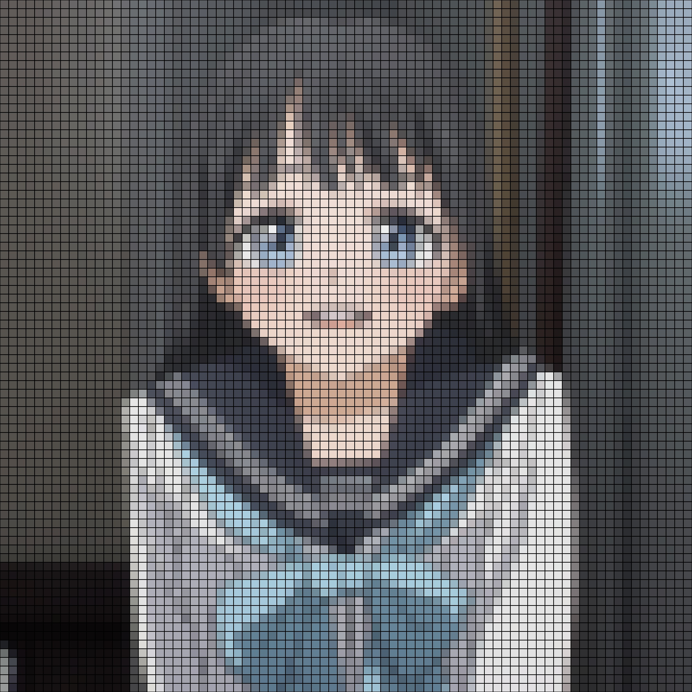

# pyPixelate
 pyPixelate pixelates your image into a pixel art asthetic.

## Example:
### Original & Output (25px per tile, 50px per tile)
<p float="left">

</p>

Credits: <a href="https://akebi-chan.jp/">https://akebi-chan.jp/</a>

## Prerequisites

- numpy
- cv2

## Usage

Windows:
```console
python pyPixelate.py <image> <block size> <output image (e.g. 1.jpg)>
```

Linux & macOS:
```console
python3 pyPixelate.py <image> <block size> <output image (e.g. 1.jpg)>
```

It might take a while to create a the Photo Mosaics.

## Parameters
- `PADDING` (Image Output Size, must be a multiple of `block size`)
- `GRID_LINES` (To produce grid lines in final output, boolean value)


